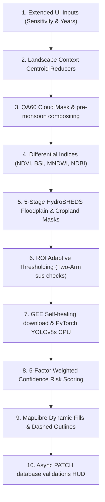

# 🛰️ Illegal Sand Mining Detection Skill

## Overview
This skill packages the complete operational biophysical and machine learning pipeline of the **From Afar** platform. It enables future agents and workspace models to execute E2E riverbed anomaly detection, calculate spectral indices differentials, run YOLOv8 object shapes detection, and maintain a secured production deployment cycle.

---

## 🛠️ The 10-Stage Scientific Pipeline



### 1. Biophysical Index Mappings
*   **NDVI (Normalized Difference Vegetation Index)**: Measures vegetation density to flag riparian canopy stripping.
*   **BSI (Bare Soil Index)**: Measures naked mineral presence to highlight exposed sand beds and stockpiles.
*   **MNDWI (Modified Normalized Difference Water Index)**: Highlights water boundaries to track course shifts and open wet excavation pits.
*   **NDBI (Normalized Difference Build-up Index)**: Segregates urban false positives.

### 2. The Adaptive Sensitivity Equation ($n_{adjusted}$)
Calculates the spatial sensitivity coefficient dynamically over target centroids:
$$\text{n\_adjusted} = \text{n\_base} + \text{aridity\_adj} + \text{ndvi\_adj} + \text{landcover\_adj}$$

---

## 🔒 Security Hardening & Deployment Guidelines

To deploy the platform live under a zero-cost stack, follow this standard security configuration:

### 1. Cross-Origin (CORS) Whitelisting
Enforce strict domain matching inside [main.py](file:///d:/Labs/Illegal%20sand%20mining%20app/backend/app/main.py) to prevent anonymous API execution:
```python
allowed_origins = [
    "http://localhost:3000",
    "https://sand-matters-studio.vercel.app"
]
app.add_middleware(
    CORSMiddleware,
    allow_origins=allowed_origins,
    allow_origin_regex="https://sand-matters-studio.*\\.vercel\\.app",
    allow_credentials=True,
    allow_methods=["*"],
    allow_headers=["*"],
)
```

### 2. Supabase Auth Bearer JWT Verification
Gating the backend `/analyze` and `/validate` routes requires token checking:
*   Pass the active session JWT inside HTTP `Authorization: Bearer <token>` from the client.
*   The backend verifies the signature in real-time with Supabase GoTrue `/auth/v1/user` services before accepting the thread.

### 3. Supabase Row-Level Security (RLS) policies
Enable PostgreSQL table constraints using [phase_three_rls.sql](file:///d:/Labs/Illegal%20sand%20mining%20app/backend/scripts/phase_three_rls.sql):
*   Allow public read access (`SELECT`) for guests to see coordinates and comments on the map basemap.
*   Enforce `auth.uid() IS NOT NULL` for `INSERT` and `UPDATE` on analyzed regions.
*   Restrict comment updates and deletes matching `auth.uid() = user_id`.

---

## 🚀 Live Cloud Deployment Stack

1.  **Frontend**: Deploy `/frontend` to **Vercel** with env `NEXT_PUBLIC_API_URL` pointing to your hosted API.
2.  **Database**: Host PostgreSQL on **Supabase** with PostGIS extension active.
3.  **Backend**: Deploy `/backend` to **Hugging Face Spaces** using the compiled [Dockerfile](file:///d:/Labs/Illegal%20sand%20mining%20app/backend/Dockerfile). This grants **16GB RAM for free** to run PyTorch inference without memory limits.

---

## ⚠️ Common Pitfalls

1.  **GEE unauthenticated limits**: High-resolution scale 10 requests will return HTTP 400 errors if pixel sizes exceed limits. Ensure a self-healing fallback loops down to scale 30 Landsat images.
2.  **PyTorch memory limits**: Running YOLOv8 on standard free-tier web instances (e.g., Render 512MB RAM) will crash the process instantly. You **must** utilize Hugging Face Spaces (16GB RAM CPU) for zero-cost ML hosting.
